<div align="center">

<a href="https://agentsdr.ai">
  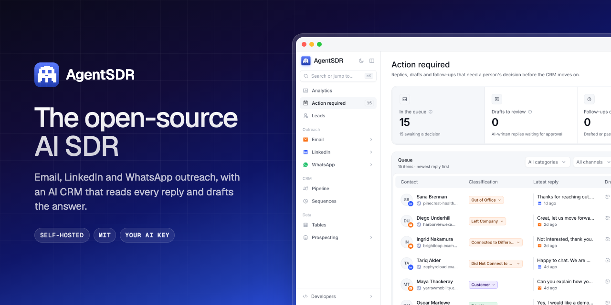
</a>

<h3>Find leads, reach them on email, LinkedIn and WhatsApp,<br>and let AI work every reply, from one workspace you run yourself.</h3>

<p>
  <a href="https://agentsdr.ai"><b>Website</b></a>
  &nbsp;·&nbsp;
  <a href="https://docs.agentsdr.ai"><b>Docs</b></a>
  &nbsp;·&nbsp;
  <a href="https://docs.agentsdr.ai/self-hosting/docker-compose"><b>Self-host</b></a>
  &nbsp;·&nbsp;
  <a href="https://github.com/Kandid-ai/AgentSDR/discussions"><b>Community</b></a>
  &nbsp;·&nbsp;
  <a href="https://github.com/Kandid-ai/AgentSDR/issues/new?template=bug_report.yml"><b>Report a bug</b></a>
</p>

<p>
  <a href="https://github.com/Kandid-ai/AgentSDR/actions/workflows/ci.yml"></a>
  <a href="LICENSE"></a>
  <a href="https://github.com/Kandid-ai/AgentSDR/stargazers"></a>
  <a href="https://docs.agentsdr.ai"></a>
  <a href="https://github.com/Kandid-ai/AgentSDR/discussions"></a>
  
  
</p>

</div>

<br>

<div align="center">
  <a href="docs/assets/video/agentsdr-film.mp4">
    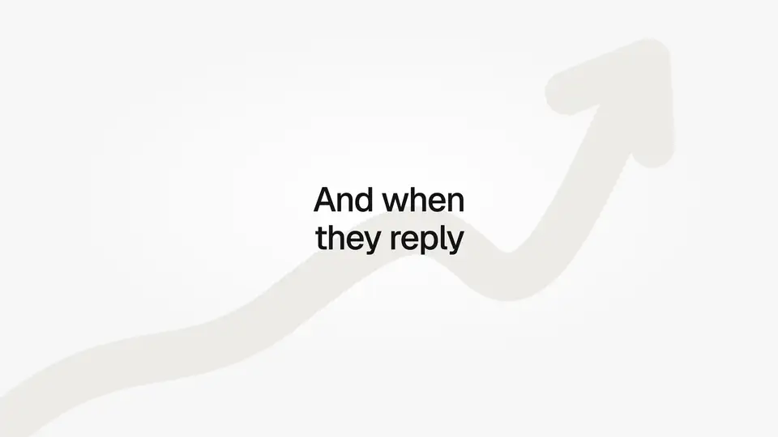
  </a>
  <br>
  <sub>Replies from every channel land in one queue. AI classifies each and drafts the answer. <a href="docs/assets/video/agentsdr-film.mp4">Watch the 51-second film</a>. Every name in it is fictional.</sub>
</div>

## Why AgentSDR

Outbound usually means stitching together a lead database, an enrichment tool, an email sequencer, a LinkedIn tool, a dialer and a CRM, each with its own seats, its own copy of your leads and its own idea of who replied. Most of them are thin layers over APIs you could call yourself.

- **One workspace instead of six tools.** One record per person and company, so a reply on LinkedIn shows up in the same queue and pipeline as an email reply.
- **The AI does the tracking.** Every reply, on every channel, is read, classified and given a drafted answer. You approve what goes out.
- **You own it.** A single Next.js app and one PostgreSQL database on your own server. Your leads, conversations and recordings never leave infrastructure you control.
- **Your keys, no seats.** Connect your own Google Workspace, Unipile, storage and any AI model on OpenRouter. No per-seat or per-contact fees: you pay your server and your providers.

## Everything in one workspace

<table>
  <tr>
    <td width="50%" valign="top">
      <a href="https://docs.agentsdr.ai/concepts">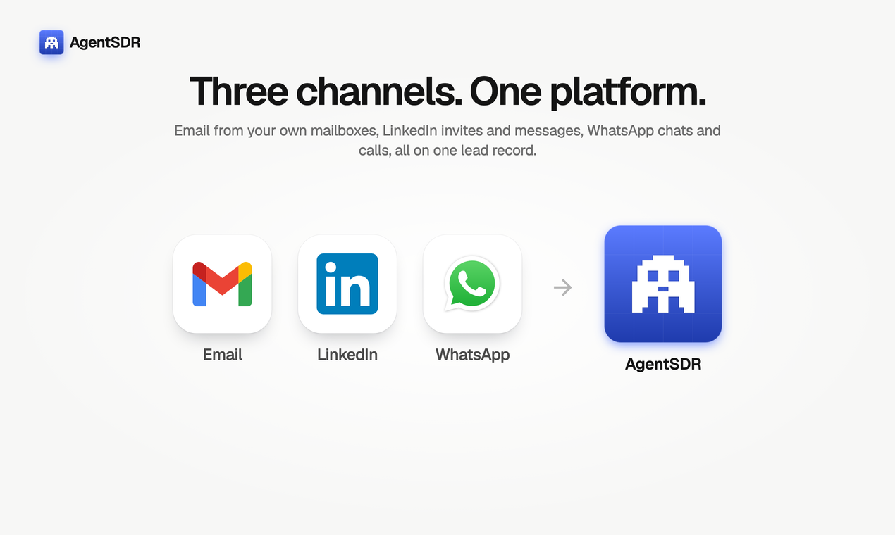</a>
      <p><b>Three channels, one lead record.</b> Email from your own mailboxes, LinkedIn invites and messages, WhatsApp chats and calls. <a href="https://docs.agentsdr.ai/concepts">How it fits together →</a></p>
    </td>
    <td width="50%" valign="top">
      <a href="https://docs.agentsdr.ai/tables/overview">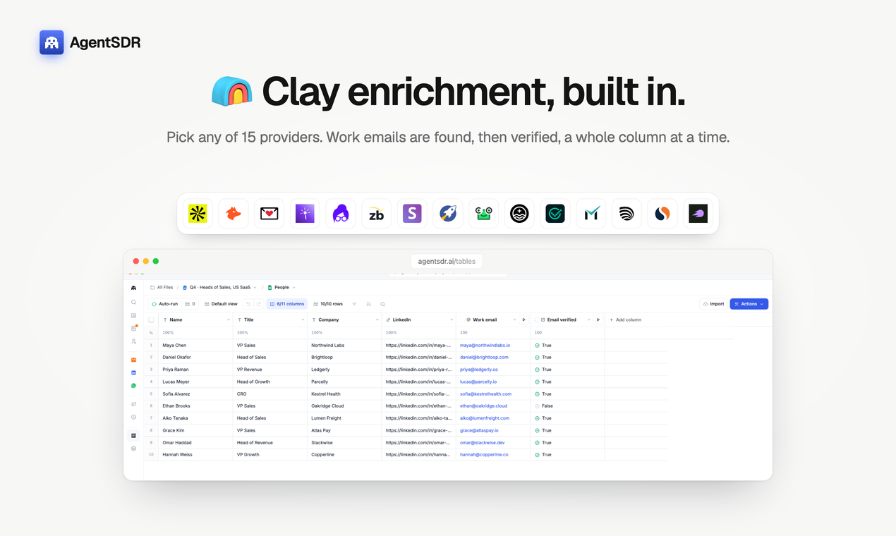</a>
      <p><b>Enrichment, built in.</b> Tables run 15 providers (Apollo, Hunter, Lusha and more), AI columns and HTTP calls, row by row. <a href="https://docs.agentsdr.ai/tables/overview">Tables →</a></p>
    </td>
  </tr>
  <tr>
    <td width="50%" valign="top">
      <a href="https://docs.agentsdr.ai/email/campaigns">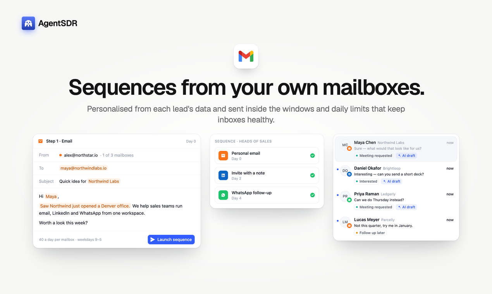</a>
      <p><b>Email sequences from your own mailboxes.</b> Google Workspace, merge fields, sending windows and daily limits that keep inboxes healthy. <a href="https://docs.agentsdr.ai/email/campaigns">Email →</a></p>
    </td>
    <td width="50%" valign="top">
      <a href="https://docs.agentsdr.ai/linkedin/campaigns">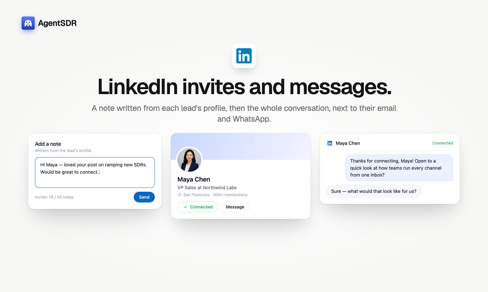</a>
      <p><b>LinkedIn invites and messages.</b> Connection requests with notes, follow-ups after acceptance, inside conservative daily limits. <a href="https://docs.agentsdr.ai/linkedin/campaigns">LinkedIn →</a></p>
    </td>
  </tr>
  <tr>
    <td width="50%" valign="top">
      <a href="https://docs.agentsdr.ai/whatsapp/calling">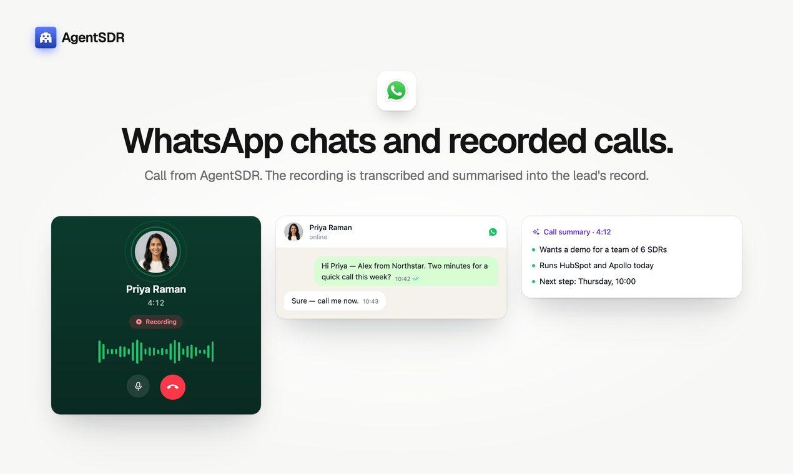</a>
      <p><b>WhatsApp chats and recorded calls.</b> Message campaigns, and calls dialed from AgentSDR, recorded to your bucket and transcribed. <a href="https://docs.agentsdr.ai/whatsapp/calling">WhatsApp →</a></p>
    </td>
    <td width="50%" valign="top">
      <a href="https://docs.agentsdr.ai/crm/action-required">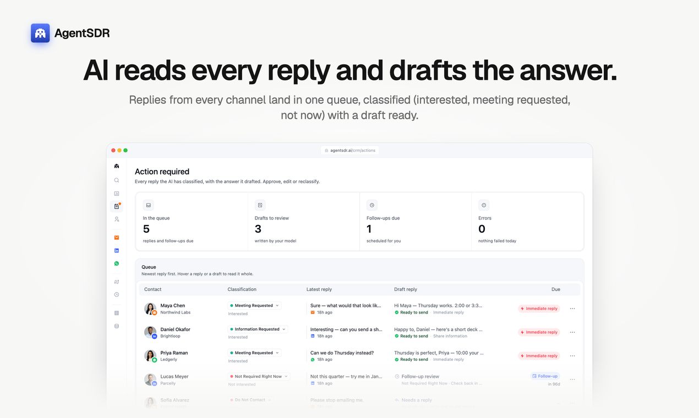</a>
      <p><b>AI reads every reply.</b> Interested, meeting requested, not now, out of office: classified with the reason shown, and a draft ready. <a href="https://docs.agentsdr.ai/crm/action-required">AI CRM →</a></p>
    </td>
  </tr>
  <tr>
    <td width="50%" valign="top">
      <a href="https://docs.agentsdr.ai/crm/action-required">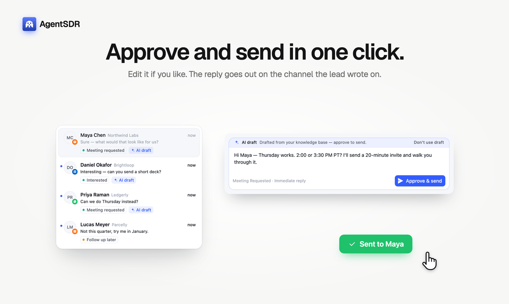</a>
      <p><b>Approve and send in one click.</b> Edit the draft if you like; it goes out on the channel the lead wrote on. Nothing sends on its own. <a href="https://docs.agentsdr.ai/crm/action-required">Drafts →</a></p>
    </td>
    <td width="50%" valign="top">
      <a href="https://docs.agentsdr.ai/crm/pipeline">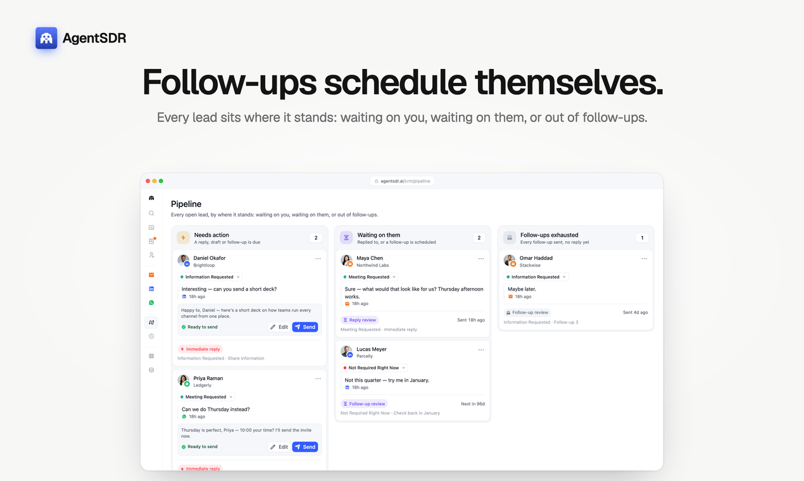</a>
      <p><b>A pipeline that keeps itself current.</b> Every lead sits where it stands, and follow-up sequences are scheduled for you. <a href="https://docs.agentsdr.ai/crm/pipeline">Pipeline →</a></p>
    </td>
  </tr>
  <tr>
    <td width="50%" valign="top">
      <a href="https://docs.agentsdr.ai/analytics">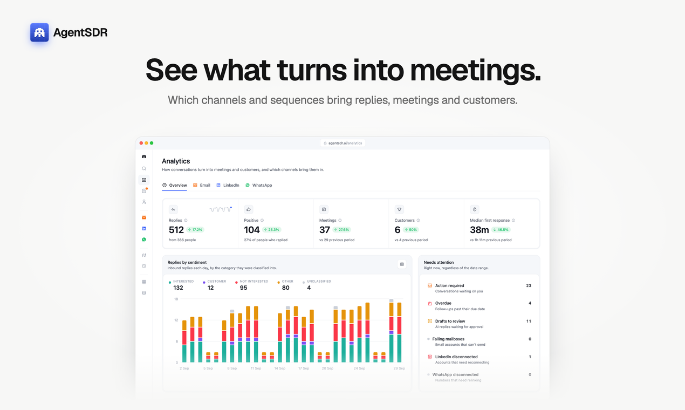</a>
      <p><b>See what turns into meetings.</b> Replies, positive replies, meetings and customers, by channel and over time. <a href="https://docs.agentsdr.ai/analytics">Analytics →</a></p>
    </td>
    <td width="50%" valign="top">
      <a href="https://docs.agentsdr.ai/self-hosting/docker-compose">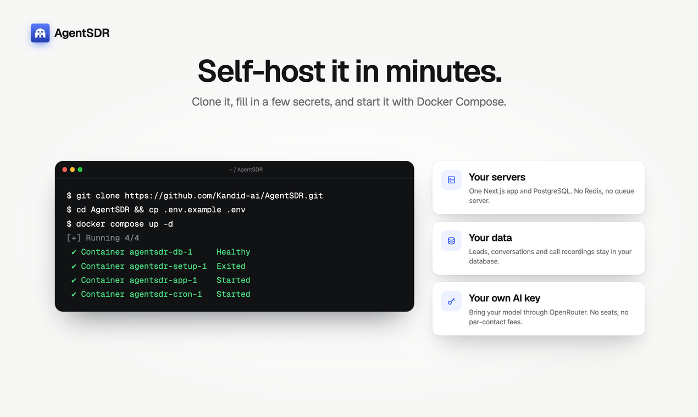</a>
      <p><b>Self-host it in minutes.</b> Clone, fill in a few secrets, <code>docker compose up -d</code>. No Redis, no queue server. <a href="https://docs.agentsdr.ai/self-hosting/docker-compose">Self-hosting →</a></p>
    </td>
  </tr>
</table>

Also inside: a lead database with custom fields, CSV and XLSX import with merge fields, Do Not Contact across every channel, organizations with roles, teams and invitations, and per-organization sending rules with safe defaults.

## Works with

<p align="center">
  &nbsp;&nbsp;&nbsp;
  &nbsp;&nbsp;&nbsp;
  &nbsp;&nbsp;&nbsp;
  &nbsp;&nbsp;&nbsp;
  &nbsp;&nbsp;&nbsp;
  &nbsp;&nbsp;&nbsp;
  <picture><source media="(prefers-color-scheme: dark)" srcset="docs/assets/readme/logos/openrouter-dark.svg"></picture>&nbsp;&nbsp;&nbsp;
  &nbsp;&nbsp;&nbsp;
  &nbsp;&nbsp;&nbsp;
  &nbsp;&nbsp;&nbsp;
  &nbsp;&nbsp;&nbsp;
  
</p>

<p align="center"><sub>Each organization connects its own accounts in Settings, with a guided setup for every field. <a href="https://docs.agentsdr.ai/integrations">All integrations →</a></sub></p>

| Service | Powers | Setup guide |
|---|---|---|
| Google Workspace | Sending and reading Gmail, through a service account | [Google Workspace](https://docs.agentsdr.ai/integrations/google-workspace) (with a 2-minute video) |
| [Unipile](https://www.unipile.com) | LinkedIn and WhatsApp accounts, messaging and calling | [Unipile](https://docs.agentsdr.ai/integrations/unipile) |
| [Cloudflare R2](https://www.cloudflare.com/developer-platform/r2/) | Call recordings and contact photos | [Cloudflare R2](https://docs.agentsdr.ai/integrations/cloudflare-r2) |
| [OpenRouter](https://openrouter.ai) | Every AI feature, on your own key and any model | [OpenRouter](https://docs.agentsdr.ai/integrations/openrouter) |
| 15 enrichment providers | Tables columns | [Enrichment providers](https://docs.agentsdr.ai/integrations/enrichment-providers) |
| [Resend](https://resend.com) | Sign-up, password-reset and invitation email | [Resend](https://docs.agentsdr.ai/integrations/resend) |

<a id="quick-start"></a>

## Get started

You need a server with Docker. Generate each secret with `openssl rand -hex 32`.

```sh
git clone https://github.com/Kandid-ai/AgentSDR.git && cd AgentSDR
cp .env.example .env          # fill in the required values
docker compose up -d          # PostgreSQL, schema, the app on :3000, the scheduler
```

Open the app and sign up: the first account and organization become the instance's operator. Then connect your services in **Settings**.

The [Docker Compose guide](https://docs.agentsdr.ai/self-hosting/docker-compose) walks through every value in `.env` and every service. There are also guides for [running from source](https://docs.agentsdr.ai/self-hosting/from-source), [deploying on a VPS with Dokploy](https://docs.agentsdr.ai/self-hosting/dokploy) and [going to production](https://docs.agentsdr.ai/self-hosting/production).

<details>
<summary><b>Run it from source</b></summary>
<br>

You need [Bun](https://bun.sh) 1.2+ and PostgreSQL 16+.

```sh
git clone https://github.com/Kandid-ai/AgentSDR.git && cd AgentSDR
bun install
createdb agentsdr
cp .env.example .env.local   # set DATABASE_URL, BETTER_AUTH_SECRET, INTEGRATION_CREDENTIALS_KEY
bun run db:setup             # create the schema in the empty database
bun run db:seed:demo         # optional: a fictional demo organization
bun run dev                  # http://localhost:3000
```

With the demo seed, sign in as `demo@example.com` / `demo-password-123`.
</details>

<details>
<summary><b>Environment variables</b></summary>
<br>

Environment variables cover only what the app needs before it can read its database. Everything else is per organization, in the app.

| Variable | Required | Purpose |
|---|---|---|
| `DATABASE_URL` | yes | PostgreSQL 16+ connection string |
| `BETTER_AUTH_SECRET` | yes | Signs sessions |
| `BETTER_AUTH_URL` | yes | Public URL, read at runtime |
| `INTEGRATION_CREDENTIALS_KEY` | yes | Encrypts integration credentials (AES-256-GCM) |
| `UNSUBSCRIBE_SECRET` | for email | Signs unsubscribe links |
| `CRON_SECRET`, `OUTREACH_TICK_SECRET` | for jobs | Authenticate scheduled-job calls |
| `RESEND_API_KEY`, `AUTH_EMAIL_FROM` | in production | Auth email through Resend |
| `AUTH_SIGNUP` | no | `invite-only` (default) or `open` |
| `GOOGLE_CLIENT_ID`, `GOOGLE_CLIENT_SECRET` | no | "Continue with Google" |
| `DB_POOL_MAX` | no | Connection pool size (default 8) |

Every variable, with how to generate it and where it is read: [Configuration reference](https://docs.agentsdr.ai/configuration).
</details>

## How it works

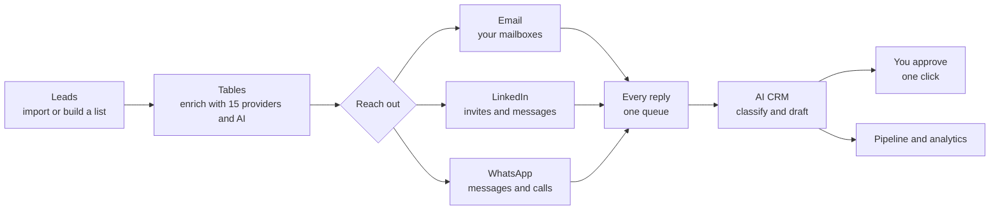

One Next.js app and one PostgreSQL database: pages, API routes and background workers run in a single process, with no queue server or Redis. Every request, job and webhook runs inside one organization's scope, and code that forgets fails closed. Integration credentials are encrypted per organization and verified with a live call before they are saved. More in [How it works](https://docs.agentsdr.ai/how-it-works) and the [architecture guide](https://docs.agentsdr.ai/architecture).

<details>
<summary><b>Architecture diagram</b></summary>
<br>

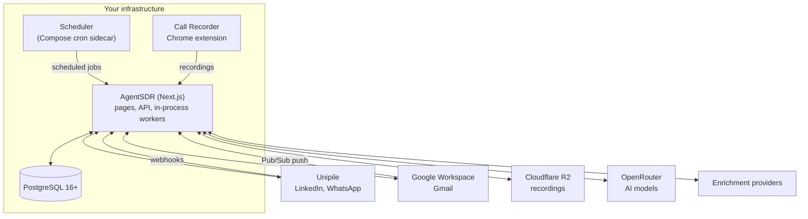
</details>

<details>
<summary><b>Project structure and development</b></summary>
<br>

```
src/app/                 Pages (App Router) and API routes
src/lib/<domain>/        Business logic, schema and queries per domain
src/components/          React components, one folder per domain
src/jobs, src/functions  LinkedIn sending engine (run by scheduled jobs)
src/services/            Unipile API clients
db/                      schema.sql (generated snapshot) and seed.sql
scripts/                 Migration history, audits, database tooling, e2e checks
extensions/whatsapp-recorder/   Chrome extension that dials and records WhatsApp calls
docker/, docker-compose.yml     Self-hosting
docs/                    Documentation (published at docs.agentsdr.ai)
```

| Command | What it does |
|---|---|
| `bun run dev` | Start the app at http://localhost:3000 |
| `bun run test` | 600+ unit tests |
| `bun run typecheck` / `bun run lint` | Must pass before every commit |
| `bun run db:setup` / `db:seed:demo` | Create the schema / a fictional demo organization |
| `bun run db:check` | Audit that every table is organization-scoped |

CI runs typecheck, lint, tests, a secret scan, the production build, the extension build and a fresh install on PostgreSQL 16, 17 and 18. See the [development guide](https://docs.agentsdr.ai/development).

**Built with** [Next.js 16](https://nextjs.org) and React 19, TypeScript, [Drizzle ORM](https://orm.drizzle.team), [Better Auth](https://www.better-auth.com), [Tailwind CSS](https://tailwindcss.com) with [AlignUI](https://www.alignui.com), and [Bun](https://bun.sh).
</details>

## Security and privacy

- **Your data stays with you.** Leads, conversations and analytics live in your PostgreSQL; call recordings in your own R2 bucket, reached only through short-lived signed links.
- **Encrypted credentials.** Every saved API key and token is encrypted with AES-256-GCM.
- **Tenant isolation, tested.** An end-to-end suite signs in as a second organization and proves it can see, change and count nothing of the first.
- **Humans approve outbound replies.** AI drafts wait for a person, and outbound work can be paused instantly.
- **Report vulnerabilities privately** through [GitHub security advisories](https://github.com/Kandid-ai/AgentSDR/security/advisories/new). See [SECURITY.md](SECURITY.md).

## Responsible use

AgentSDR contacts people on your behalf, so how it is used is your responsibility. LinkedIn's terms do not allow automation and accounts can be restricted; WhatsApp bans numbers that send unsolicited bulk messages; cold email is regulated by laws such as CAN-SPAM, GDPR and CASL; and many places require consent before a call is recorded. Sending limits, unsubscribe links and Do Not Contact reduce the risk but do not make any use compliant. Read [Responsible use](https://docs.agentsdr.ai/responsible-use) before you start.

## FAQ

<details>
<summary><b>Is AgentSDR free?</b></summary>

Yes. It is open source and you host it yourself, so there are no seats, tiers or per-contact fees. You pay for your server, the accounts you connect (Google Workspace, Unipile) and your own AI usage. It is MIT-licensed, so you can also use, change and build on it commercially.
</details>

<details>
<summary><b>Which email providers can it send from?</b></summary>

Google Workspace mailboxes, connected once through a service account with domain-wide delegation. Each mailbox has its own daily limit (30 by default), sending hours and signature. Microsoft 365 is not supported yet.
</details>

<details>
<summary><b>Will LinkedIn automation get my account restricted?</b></summary>

No tool can promise that, but AgentSDR stays well inside LinkedIn's limits: 30 invitations a day on premium accounts and 5 on free, a random 30 to 60 second gap between invitations, optional working hours per account, and an account that hits LinkedIn's own limit pauses for the day.
</details>

<details>
<summary><b>How does WhatsApp calling work?</b></summary>

You link your number through Unipile and install the AgentSDR Call Recorder Chrome extension. When you call a lead from AgentSDR, the extension dials inside WhatsApp Web and records both sides; the recording goes to your storage bucket and your chosen model transcribes it. It relies on WhatsApp Web's English interface.
</details>

<details>
<summary><b>Which AI models can I use?</b></summary>

Any model on OpenRouter, with your own key. Each call is pinned to the provider you picked, with fallbacks turned off, so your data only goes where you chose.
</details>

<details>
<summary><b>Does the AI send replies on its own?</b></summary>

No. Drafts, including follow-up sequence steps, wait in *Action required* until someone sends them, as written or edited. The AI can move a lead forward in the pipeline when it is confident; anything else is held for a person.
</details>

<details>
<summary><b>Can my whole team use it?</b></summary>

Yes. Invite teammates from Settings → Members with the owner, admin or member role. One deployment can also hold several organizations, each fully separate.
</details>

## Community and support

| Where | Best for |
|---|---|
| [Docs](https://docs.agentsdr.ai) | Setup guides, every feature, troubleshooting |
| [GitHub Discussions](https://github.com/Kandid-ai/AgentSDR/discussions) | Questions, ideas, and showing what you built |
| [GitHub Issues](https://github.com/Kandid-ai/AgentSDR/issues/new/choose) | Bugs and feature requests (in the app: **Help → Report a bug**) |
| [Security advisories](https://github.com/Kandid-ai/AgentSDR/security/advisories/new) | Vulnerabilities, reported privately |

## Contributing

Contributions are welcome: bug reports, fixes, enrichment providers, docs. Start with [CONTRIBUTING.md](CONTRIBUTING.md) for the development setup, the checks a pull request must pass and the commit conventions; issues labelled [`good first issue`](https://github.com/Kandid-ai/AgentSDR/labels/good%20first%20issue) are a good way in. Also see the [Code of Conduct](CODE_OF_CONDUCT.md), [how the project is run](GOVERNANCE.md) and [what changed](CHANGELOG.md).

## License

AgentSDR is open source under the [MIT License](LICENSE):

- **You may** use, copy, modify, self-host, distribute and sell AgentSDR, including in commercial products and as a hosted service.
- **You don't have to** publish your changes, though contributions back are always welcome.
- Keep the copyright and license notice in copies you distribute.

The [LICENSE](LICENSE) file is the binding text.

<details>
<summary>Acknowledgements</summary>
<br>

- The sign-in page photograph is by [Marek Piwnicki](https://unsplash.com/photos/w4sxddUJ5-0) on Unsplash.
- Built on [Next.js](https://nextjs.org), [Drizzle](https://orm.drizzle.team), [Better Auth](https://www.better-auth.com), [AlignUI](https://www.alignui.com) and [Remix Icon](https://remixicon.com).
</details>

<div align="center">
<br>
<a href="https://agentsdr.ai"></a>
<br>
<sub>Made by <a href="https://kandid.ai">Kandid</a> · If AgentSDR is useful to you, a ⭐ helps others find it.</sub>
</div>
