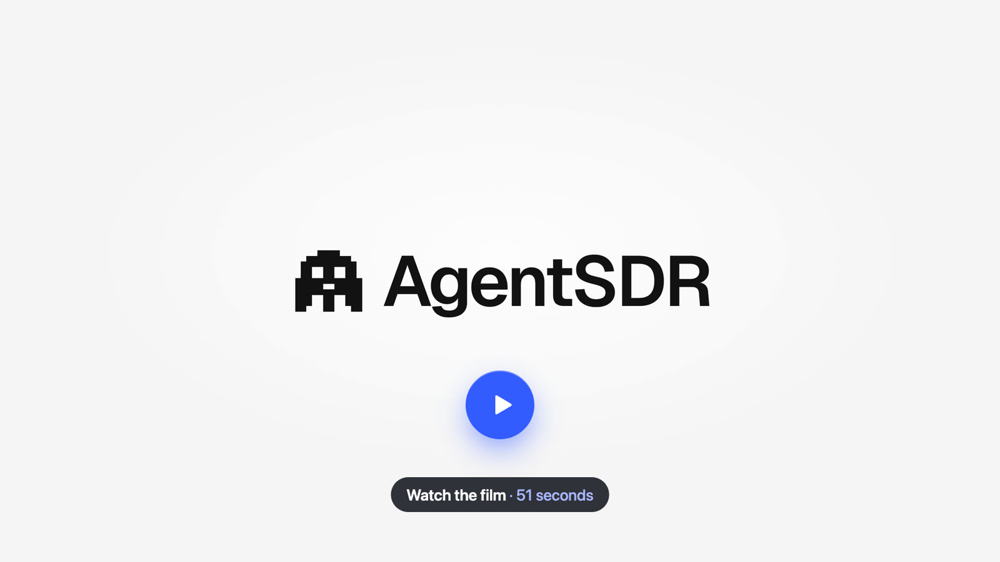
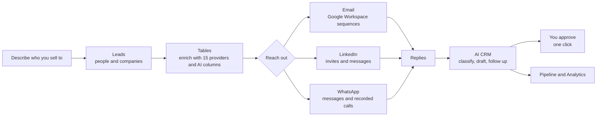
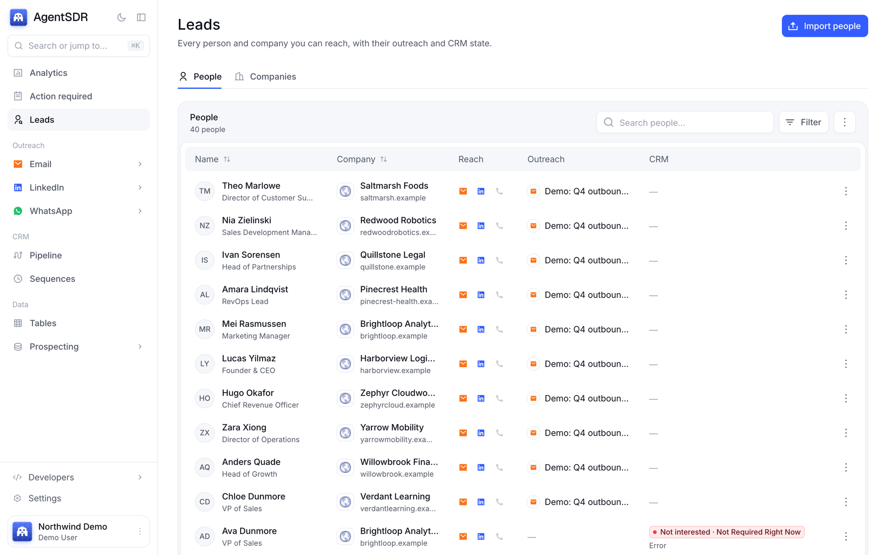
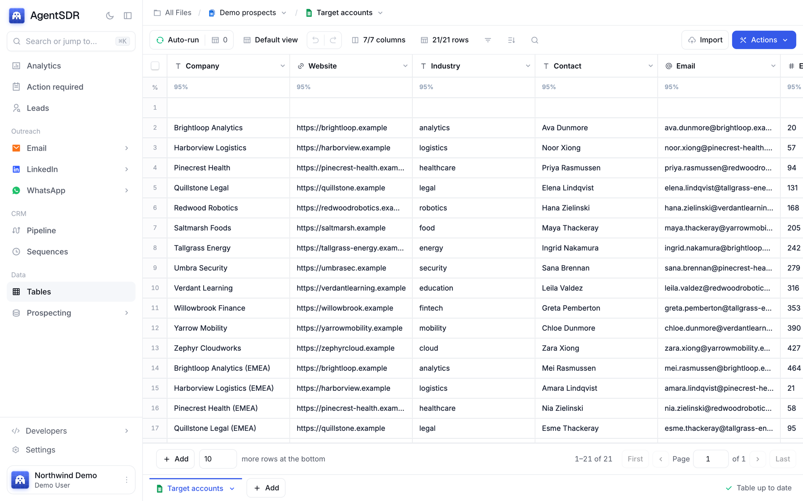
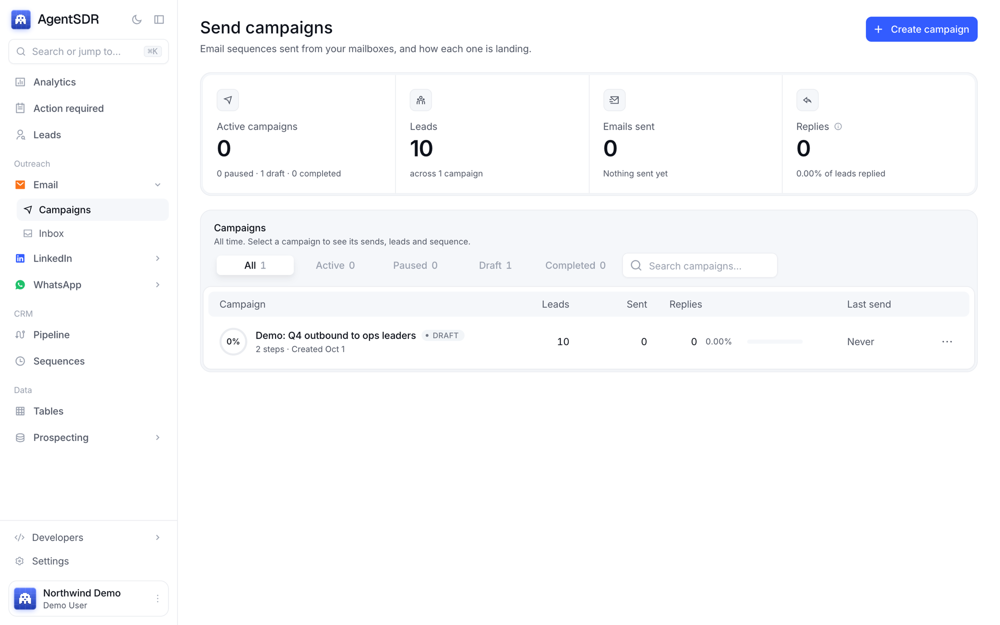
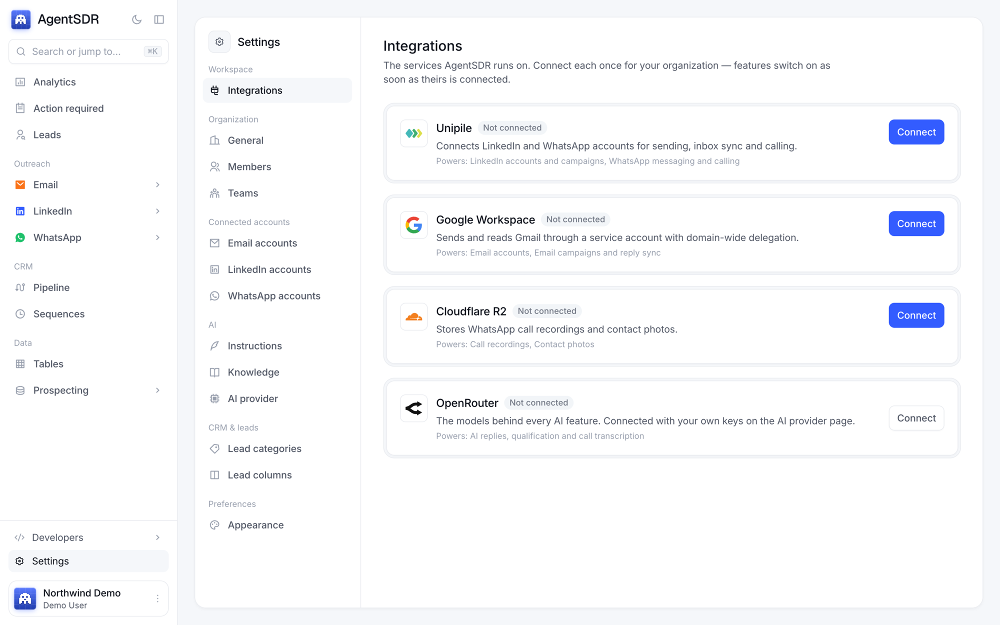
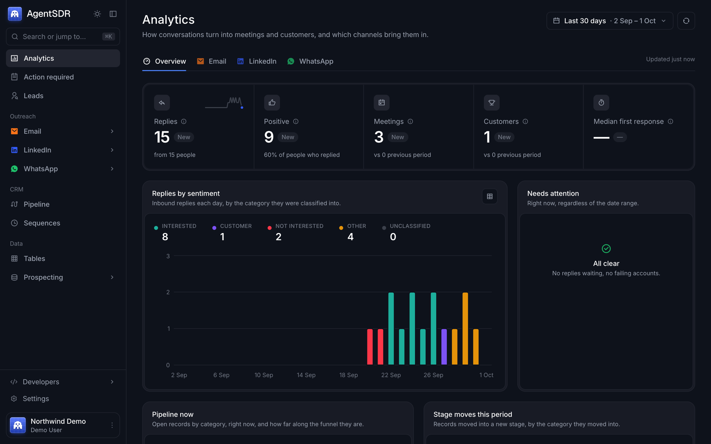
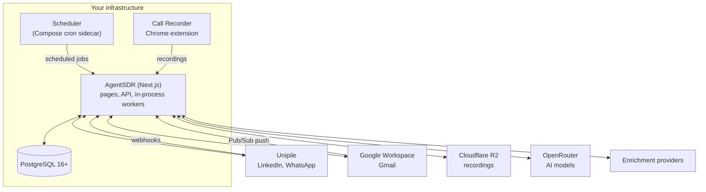

<div align="center">


# AgentSDR

**The open-source AI SDR.**<br>
Find leads, reach them on email, LinkedIn and WhatsApp, and let AI work every reply,
from one workspace you run yourself.

[](https://github.com/Kandid-ai/AgentSDR/actions/workflows/ci.yml)
[](#license)
[](https://nextjs.org)
[](docs/self-hosting.md#requirements)
[](tsconfig.json)
[](CODE_OF_CONDUCT.md)

[Watch the film](#see-it-in-action) · [Quick start](#quick-start) · [Documentation](docs/README.md) · [Self-hosting](docs/self-hosting.md) · [Report a bug](https://github.com/Kandid-ai/AgentSDR/issues/new/choose)

<br>

<a href="docs/assets/video/agentsdr-film.mp4">
  
</a>

</div>

---

## Contents

- [About](#about)
- [See it in action](#see-it-in-action)
- [How it works](#how-it-works)
- [Features](#features)
- [Screenshots](#screenshots)
- [Quick start](#quick-start)
- [Connecting your services](#connecting-your-services)
- [Configuration](#configuration)
- [Architecture](#architecture)
- [Project structure](#project-structure)
- [Development](#development)
- [Security and privacy](#security-and-privacy)
- [Responsible use](#responsible-use)
- [FAQ](#faq)
- [Contributing](#contributing)
- [License](#license)
- [Acknowledgements](#acknowledgements)

---

## About

**AgentSDR does the work of a sales development team.** It finds and enriches
the people you sell to, reaches them on the channels they actually answer
(email, LinkedIn and WhatsApp), and when they reply it reads every message,
sorts it, drafts the next one and keeps the follow-ups on time. You approve
what goes out; it does the rest.

Outbound usually means stitching together a stack: a lead database, an
enrichment tool, an email sequencer, a LinkedIn tool, a dialer and a CRM, each
with its own seats, its own copy of your leads and its own idea of who replied.
AgentSDR replaces that stack with one workspace and one lead record per
person, so a reply on LinkedIn stops the email sequence and shows up in the
same pipeline as everything else.

**You run it.** AgentSDR is a single Next.js application on a single
PostgreSQL database, with no queue server, no Redis and no hosted service in the
middle. Your leads, conversations and recordings stay in infrastructure you
control. You connect your own Google Workspace, Unipile, storage and AI keys,
so there are no seats, tiers or per-contact fees: you pay for your server and
your own usage.

**Built for:**

- **Founders and small sales teams** who want outbound running without hiring
  an SDR team or paying for six tools.
- **Revenue and growth teams** who want their prospecting data, conversations
  and AI in their own database.
- **Agencies and operators** running outreach for their own pipeline across
  several organizations from one deployment.

AgentSDR is built by [Kandid](https://kandid.ai) and is
[open source](#license) under the AGPL-3.0: free to use, self-host and change.

## See it in action

<div align="center">
  <a href="docs/assets/video/agentsdr-film.mp4">
    
  </a>
  <br>
  <sub>Replies from every channel land in one queue; AI classifies each, drafts the answer, and follow-ups schedule themselves. <a href="docs/assets/video/agentsdr-film.mp4">Watch the full 51-second film</a>, built with <a href="https://www.remotion.dev">Remotion</a> from the app's own components. Every name in it is fictional.</sub>
</div>

## How it works



1. **Find.** Import a CSV or spreadsheet, or build a list in Tables. Every
   person and company lands in one lead database, with custom fields of your own.
2. **Enrich.** Tables fills in emails, phone numbers and company data from the
   enrichment provider you choose, and AI columns research or write per row.
3. **Reach.** Sequences go out from your own mailboxes, LinkedIn accounts and
   WhatsApp numbers, inside sending windows and daily limits that keep accounts
   healthy.
4. **Reply.** Every answer, on every channel, lands in one queue. AI classifies
   it (interested, meeting requested, not now, out of office, referral and
   more), drafts the reply and schedules the follow-up.
5. **Close.** You approve drafts in one click, the pipeline moves, and Analytics
   shows which channels turn conversations into meetings and customers.

## Features

### Leads database

- One record per **person** and **company**, with their outreach and CRM state
  side by side.
- Import CSV or XLSX; any column beyond the basics becomes a **merge field**
  (`"Job Title"` becomes `{{jobTitle}}`).
- **Custom fields per organization**: add, rename, retype or archive them in
  Settings, without a schema migration.
- Do Not Contact and suppression are respected across every channel.

### Tables (enrichment)

- A spreadsheet for building lists: columns can run **AI prompts**, call
  **enrichment providers** or make **HTTP requests**, row by row.
- **15 enrichment providers**: Apollo, Cleanlist, ContactOut, Findymail,
  FullEnrich, Hunter, Icypeas, LeadMagic, Lusha, MillionVerifier, RocketReach,
  Semrush, Similarweb, Snov and ZeroBounce. Connect several accounts per
  provider.
- Runs in the background with auto-run, per-cell status and retries.

### Email outreach

- Multi-step **sequences** sent from Google Workspace mailboxes, connected once
  through a service account.
- Per-mailbox **daily limits** (30 by default), sending windows and signatures;
  several campaigns can share a pool of mailboxes.
- **Reply detection** and bounce suppression, a shared **inbox**, and
  **one-click unsubscribe** on every email.

### LinkedIn automation

- Connection requests and message sequences through
  [Unipile](https://www.unipile.com), with **search import** and inbox sync.
- Stays well inside LinkedIn's limits: 30 invites a day on premium accounts and
  5 on free, a random 30 to 60 second gap between invites, sending only within
  each account's working hours, and an automatic pause when LinkedIn pushes back.

### WhatsApp

- **Messaging** through Unipile with server-side guards: no new chats for 24
  hours after a number is linked, 25 new chats a day per number, 10 seconds
  between sends, and never to Do Not Contact.
- **Recorded calls.** The AgentSDR Call Recorder Chrome extension dials inside
  WhatsApp Web, records both sides to your own storage bucket, and your chosen
  model transcribes it.

### AI CRM

- Replies from **every channel** in one queue, one conversation per lead.
- **Classification** into categories you control, with the reason shown.
- **Drafts** that use your instructions and knowledge base; they wait in
  *Action required* until a person sends them, as written or edited.
- **Follow-up sequences** that run themselves and stop when the lead answers.
- A **pipeline** board (needs action, waiting on them, follow-ups exhausted).
  The AI moves a lead forward only when it is confident; anything else is held
  for a person.

### Analytics

- Replies, positive replies, meetings, customers and median first-response
  time, compared with the previous period.
- Broken down by channel (email, LinkedIn, WhatsApp) and by sentiment over time,
  plus a live *Needs attention* list.

### Organizations and teams

- Multi-tenant from the ground up, on [Better Auth](https://www.better-auth.com):
  email and password with verification, optional Google sign-in, password
  reset.
- **Organizations** with owner, admin and member roles, **teams**, and
  invitations by email.
- **Invite-only by default**: the first account sets up the instance, everyone
  after that needs an invitation (`AUTH_SIGNUP=open` opens it).
- Every record belongs to exactly one organization; a second organization sees,
  changes and counts nothing of the first.

### Bring your own keys

- Every AI feature (classification, drafts, transcription, AI columns) runs on
  **any model on [OpenRouter](https://openrouter.ai)** with your organization's
  own key, pinned to the provider you pick with fallbacks off.
- Each organization connects its own Unipile, Google Workspace and R2 on each
  channel's **Connection** page in Settings, with guided setup, and its
  enrichment accounts per table.
- Sending limits — emails a day, LinkedIn invitations, WhatsApp warm-up and
  new chats — are **Sending rules** per organization, with safe defaults,
  hard ceilings and per-account overrides.

## Screenshots

<table>
  <tr>
    <td width="50%"></td>
    <td width="50%"></td>
  </tr>
  <tr>
    <td align="center"><sub><b>Leads</b>: everyone you can reach, with their outreach and CRM state</sub></td>
    <td align="center"><sub><b>Tables</b>: build and enrich lists row by row</sub></td>
  </tr>
  <tr>
    <td width="50%"></td>
    <td width="50%"></td>
  </tr>
  <tr>
    <td align="center"><sub><b>Email campaigns</b>: sequences, sends and replies</sub></td>
    <td align="center"><sub><b>Integrations</b>: each organization connects its own services</sub></td>
  </tr>
</table>

<details>
<summary><b>Dark mode</b></summary>
<br>

</details>

<sub>Screenshots use the fictional data from <code>bun run db:seed:demo</code>.</sub>

## Quick start

### Docker Compose

You need Docker with Compose.

```sh
git clone https://github.com/Kandid-ai/AgentSDR.git
cd AgentSDR
cp .env.example .env
```

Fill in the required values in `.env` (generate each secret with
`openssl rand -hex 32`):

| Variable | What it is |
|---|---|
| `POSTGRES_PASSWORD` | Password for the bundled PostgreSQL |
| `BETTER_AUTH_SECRET` | Signs sessions; keep it stable |
| `BETTER_AUTH_URL` | The app's public URL, e.g. `https://sdr.example.com` |
| `INTEGRATION_CREDENTIALS_KEY` | Encrypts every saved integration credential; never change it casually |
| `UNSUBSCRIBE_SECRET` | Signs one-click unsubscribe links |
| `CRON_SECRET`, `OUTREACH_TICK_SECRET` | Authenticate the scheduled jobs |

Then start it:

```sh
docker compose up -d
```

That starts PostgreSQL, creates the schema on first run, then runs the app on
port 3000 and a small scheduler for the periodic jobs. Already have a hosted
PostgreSQL? Point AgentSDR at it instead of the bundled one:
[Using your own PostgreSQL](docs/self-hosting.md#using-your-own-postgresql). Open the app and sign
up: the first account and organization become the instance's operator.

Without an email service configured, the verification email is written to the
log; read it with `docker compose logs app`. The full guide (production
settings, webhooks, upgrades, backups) is [docs/self-hosting.md](docs/self-hosting.md).

### From source

You need [Bun](https://bun.sh) 1.2+ and PostgreSQL 16+.

```sh
git clone https://github.com/Kandid-ai/AgentSDR.git
cd AgentSDR
bun install
createdb agentsdr
cp .env.example .env.local   # set DATABASE_URL, BETTER_AUTH_SECRET, INTEGRATION_CREDENTIALS_KEY
bun run db:setup             # create the schema in the empty database
bun run db:seed:demo         # optional: a fictional demo organization
bun run dev                  # http://localhost:3000
```

With the demo seed, sign in as `demo@example.com` / `demo-password-123`.

## Connecting your services

Third-party services are not configured in environment variables. Each
organization connects its own in Settings, on the **Connection** page of the
channel it powers (Email, LinkedIn, WhatsApp), with step-by-step
help for every field, and each feature switches on once the service it needs is
connected.

| Service | Powers | Guide |
|---|---|---|
| [Unipile](https://www.unipile.com) | LinkedIn and WhatsApp accounts, messaging and calling | [Unipile](docs/integrations.md#unipile) |
| Google Workspace | Sending and reading Gmail through a service account | [Google Workspace](docs/integrations.md#google-workspace) |
| [Cloudflare R2](https://www.cloudflare.com/developer-platform/r2/) | Call recordings and contact photos | [Cloudflare R2](docs/integrations.md#cloudflare-r2) |
| [OpenRouter](https://openrouter.ai) | Every AI feature, on your own key | [OpenRouter](docs/integrations.md#openrouter-ai-provider) |
| Enrichment providers | Tables columns (15 providers) | [Enrichment](docs/integrations.md#enrichment-providers-tables) |
| [Resend](https://resend.com) | Verification, password-reset and invitation email (per instance) | [Resend](docs/integrations.md#resend) |

## Configuration

Environment variables cover only what the app needs before it can read its
database: the database itself, sign-in, the encryption key, public URLs, job
secrets and tuning knobs. Everything else is per organization, in the app.

| Variable | Required | Purpose |
|---|---|---|
| `DATABASE_URL` | yes | PostgreSQL 16+ connection string |
| `DATABASE_SSL` | no | `disable` for a database without TLS (local, Compose) |
| `BETTER_AUTH_SECRET` | yes | Signs sessions |
| `BETTER_AUTH_URL` | yes | Public URL, read at runtime |
| `INTEGRATION_CREDENTIALS_KEY` | yes | Encrypts integration credentials (AES-256-GCM) |
| `UNSUBSCRIBE_SECRET` | for email | Signs unsubscribe links |
| `CRON_SECRET`, `OUTREACH_TICK_SECRET` | for jobs | Authenticate scheduled-job calls |
| `RESEND_API_KEY`, `AUTH_EMAIL_FROM` | in production | Auth email through Resend |
| `AUTH_SIGNUP` | no | `invite-only` (default) or `open` |
| `GOOGLE_CLIENT_ID`, `GOOGLE_CLIENT_SECRET` | no | "Continue with Google" |
| `DEFAULT_PHONE_COUNTRY` | no | Country for phone numbers typed without `+` |
| `DB_POOL_MAX` | no | Connection pool size (default 8) |

Every variable, with defaults and where it is read, is in
[docs/configuration.md](docs/configuration.md). The annotated template is
[.env.example](.env.example).

## Architecture



- **One app, one database.** Pages, API routes and background workers run in a
  single Next.js process. The enrichment and CRM workers claim jobs with
  `SKIP LOCKED`; the email sender ticks once a minute. Run one instance.
- **Organization scope everywhere.** Every request, worker job and webhook runs
  inside one organization's scope; queries filter by it, and code that forgets
  fails closed instead of reading across organizations.
- **Integrations in the database.** Credentials are encrypted per organization
  and verified with a live call before they are saved.

More in [docs/architecture.md](docs/architecture.md) and
[docs/database.md](docs/database.md).

## Project structure

```
src/app/                 Pages (App Router) and API routes
src/lib/<domain>/        Business logic, schema and queries per domain
                         (outreach, crm, leads, grid, linkedin, whatsapp, calls, auth, ...)
src/components/          React components, one folder per domain
src/jobs, src/functions  LinkedIn sending engine (run by scheduled jobs)
src/services/            Unipile API clients
src/proxy.ts             Request gate
src/instrumentation.ts   Starts the in-process workers
db/                      schema.sql (generated snapshot) and seed.sql
scripts/                 Migrations history, audits, database tooling, e2e checks
extensions/whatsapp-recorder/   Chrome extension that dials and records WhatsApp calls
docker/, docker-compose.yml     Self-hosting
docs/                    Documentation
video/                   The launch film (Remotion)
```

## Development

| Command | What it does |
|---|---|
| `bun run dev` | Start the app at http://localhost:3000 |
| `bun run build` / `bun run start` | Production build and server |
| `bun run test` | 560+ unit tests (`bun test --conditions=react-server`) |
| `bun run typecheck` | `tsc --noEmit`; must pass before every commit |
| `bun run lint` | ESLint |
| `bun run db:setup` | Create the schema in an empty database |
| `bun run db:seed:demo` | Fictional demo organization and user |
| `bun run db:check` | Audit that every table is organization-scoped |
| `bun run db:schema:dump` | Regenerate `db/schema.sql` after a schema change |
| `bun run build:recorder` | Build the Call Recorder extension into `extensions/whatsapp-recorder/dist` |

CI runs typecheck, lint, tests, the production build, the extension build and
a fresh install on PostgreSQL 16, 17 and 18. The development guide, including
how to change the database and the end-to-end checks, is
[docs/development.md](docs/development.md).

**Stack:** [Next.js 16](https://nextjs.org) and React 19, TypeScript,
[Drizzle ORM](https://orm.drizzle.team) on [postgres.js](https://github.com/porsager/postgres),
[Better Auth](https://www.better-auth.com), [Tailwind CSS](https://tailwindcss.com)
with the [AlignUI](https://www.alignui.com) design system, [Bun](https://bun.sh)
for tooling and tests, and [Remotion](https://www.remotion.dev) for the film.

## Security and privacy

- **Your data stays with you.** Leads, conversations and analytics live in your
  PostgreSQL; call recordings in your own R2 bucket, reached only through
  short-lived signed links.
- **Encrypted credentials.** Every saved API key and token is encrypted with
  AES-256-GCM under `INTEGRATION_CREDENTIALS_KEY`.
- **Tenant isolation, tested.** An end-to-end suite signs in as a second
  organization and proves it can see, change and count nothing of the first,
  across every API route and page.
- **Humans approve outbound replies.** AI drafts wait for a person; outbound
  work can be paused instantly with kill switches.
- **Responsible disclosure.** Report vulnerabilities privately, as described in
  [SECURITY.md](SECURITY.md).

## Responsible use

AgentSDR contacts people on your behalf, so how it is used is your
responsibility. LinkedIn's terms do not allow automation and accounts can be
restricted; WhatsApp bans numbers that send unsolicited bulk messages; cold
email is regulated by laws such as CAN-SPAM, GDPR and CASL; and many places
require consent before a call is recorded. AgentSDR's sending limits,
unsubscribe links and Do Not Contact reduce the risk but do not make any use
compliant. Read [docs/responsible-use.md](docs/responsible-use.md) before you
start.

## FAQ

<details>
<summary><b>Is AgentSDR free?</b></summary>

Yes. It is open source and you host it yourself, so there are no seats, tiers
or per-contact fees; you pay for your server, the accounts you connect (Google
Workspace, Unipile) and your own AI usage. See [License](#license) for what the
AGPL asks of you if you offer a modified version to others.
</details>

<details>
<summary><b>Which email providers can it send from?</b></summary>

Google Workspace mailboxes, connected through a service account with
domain-wide delegation. Each mailbox has its own daily limit (30 by default),
sending window and signature, and several campaigns can share the same pool.
Other providers aren't supported yet.
</details>

<details>
<summary><b>Will LinkedIn automation get my account restricted?</b></summary>

No tool can promise that, but AgentSDR stays well inside LinkedIn's limits: 30
invites a day on premium accounts and 5 on free, a random 30 to 60 second gap
between invites, sending only inside each account's working hours, and an
account that hits LinkedIn's own limit pauses for the day.
</details>

<details>
<summary><b>How does WhatsApp calling work?</b></summary>

You link your number through Unipile and install the AgentSDR Call Recorder
Chrome extension. When you call a lead from AgentSDR, the extension dials inside
WhatsApp Web and records both sides; the recording goes to your storage bucket
and your chosen model transcribes it. It relies on WhatsApp Web's English
interface.
</details>

<details>
<summary><b>Which AI models can I use?</b></summary>

Any model on OpenRouter, with your own key. Each call is pinned to the provider
you picked, with fallbacks turned off, so your data only goes where you chose.
</details>

<details>
<summary><b>Does the AI send replies on its own?</b></summary>

No. Drafts wait in *Action required* until someone sends them, as written or
edited. The AI can move a lead forward in the pipeline when it is confident; a
sideways or backward move, a low-confidence call and every new customer are held
for a person.
</details>

<details>
<summary><b>Can my whole team use it?</b></summary>

Yes. Invite teammates into your organization from Settings → Members and give
them the owner, admin or member role. One deployment can also hold several
organizations, each fully separate.
</details>

<details>
<summary><b>What do I need to deploy it?</b></summary>

A server that runs Docker (or Bun and Node.js), PostgreSQL 16 or newer, and a
public HTTPS address if you want webhooks and email links to work. See
[docs/self-hosting.md](docs/self-hosting.md).
</details>

## Contributing

Contributions are welcome: bug reports, fixes, enrichment providers, docs.
Start with [CONTRIBUTING.md](CONTRIBUTING.md), which covers the development
setup, the checks a pull request must pass and the commit conventions.
Contributions are accepted under the project's license (AGPL-3.0).

- **Questions and help:** [SUPPORT.md](SUPPORT.md)
- **Code of Conduct:** [CODE_OF_CONDUCT.md](CODE_OF_CONDUCT.md)
- **How the project is run:** [GOVERNANCE.md](GOVERNANCE.md)
- **What changed:** [CHANGELOG.md](CHANGELOG.md)

## License

AgentSDR is open source under the
[GNU Affero General Public License v3.0](LICENSE) (AGPL-3.0-only). In short:

- **You may** use, copy, modify, self-host and distribute AgentSDR, including
  for commercial purposes and as a hosted service.
- **If you modify it** and let others use your version over a network (for
  example as a hosted service), you must make your modified source code
  available to those users under the same license.
- Keep the license and copyright notices.

The [LICENSE](LICENSE) file is the binding text.

## Acknowledgements

- The sign-in page photograph is by [Marek Piwnicki](https://unsplash.com/photos/w4sxddUJ5-0)
  on Unsplash.
- Built on [Next.js](https://nextjs.org), [Drizzle](https://orm.drizzle.team),
  [Better Auth](https://www.better-auth.com), [AlignUI](https://www.alignui.com),
  [Remix Icon](https://remixicon.com) and [Remotion](https://www.remotion.dev).

<div align="center">
<br>

<br>
<sub>Made by <a href="https://kandid.ai">Kandid</a>.</sub>
</div>
