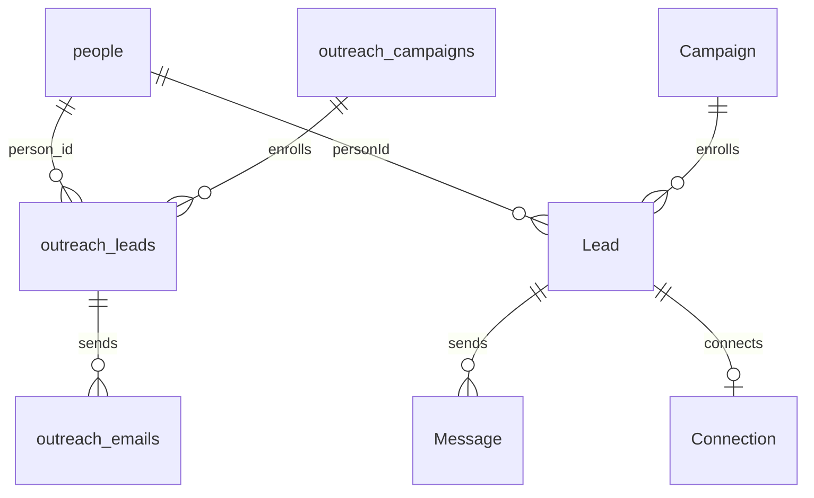

# Unified Lead Database

Status: runtime changes implemented locally; production migration is not yet approved or run.
Date: 2026-08-27.

## Ownership model

- `people.id` is the permanent identity shared by every channel.
- New imports and enrichment write mapped values to their proper typed People
  and Company columns. Only unmapped extra values go to `people.raw` JSONB.
- The one exception is the legacy campaign backfill: because old column names
  are not a trustworthy mapping contract, it preserves every non-identity
  value in `people.raw` exactly for existing template compatibility.
- `outreach_leads` is an Email campaign enrollment and references `people.id`
  through `person_id`.
- `Lead` is a LinkedIn campaign enrollment and always references the Person
  created or reused when the campaign row is added.
- `Lead.sourceLinkedinIdentifier` holds that exact unresolved provider/public
  identifier and `sourceLinkedinApi` records `sales_navigator` or `recruiter`
  when required. Neither value is canonical People identity.
- Campaign enrollment rows store execution state, not a profile copy.
- Sent/received message tables retain final content and provider/thread IDs.
- `campaign_members` is no longer part of the runtime model.

## Import and send flow

1. Normalize Email identity, but preserve a LinkedIn search identifier exactly
   on `Lead`; do not put it in `people.linkedin_url`.
2. Create or reuse `people` immediately, store all mapped profile fields there,
   and attach its `personId` to the campaign Lead. A provisional Person may
   temporarily have neither Email nor canonical LinkedIn URL.
3. The profile resolver selects the oldest active `PENDING` rows whose
   `sourceLinkedinIdentifier` is present, passes the identifier and API hint to
   Unipile, and reads the returned `provider_id` and `public_identifier`.
4. In one transaction it enriches the same Person with canonical identity and
   profile data, saves `Lead.providerId`, and clears both source fields. If the
   canonical identity already belongs to another Person, the Lead is safely
   relinked to that existing Person. A failed lookup retains the source for retry.
5. Invitation eligibility requires `personId`, `providerId`, and an empty
   `sourceLinkedinIdentifier`, so an unresolved lead cannot be contacted.

For Email campaign imports, the direct flow remains:

1. Normalize Email and optional canonical LinkedIn identity.
2. Upsert `people` by either identity.
   If an incoming row matches one identity but conflicts with the person's
   other existing identity, reject it for review instead of silently replacing
   an Email address or LinkedIn profile.
3. Write mapped fields such as name, title and company to their canonical
   People/Company columns, and merge only unmapped extras into `people.raw`.
4. Insert the channel enrollment with `person_id` and execution fields.
5. At send time, load the person, flatten `email`, `linkedin_url` and `raw`
   into one case-insensitive template-variable map, render, send and save the
   final message.

At send time the template context combines canonical fields and `people.raw`.
Canonical mapped fields take precedence over an extra JSON key with the same
name. For example, `people.first_name = "Pat"`, `companies.name = "Acme"` and
`people.raw = {"icebreaker":"Saw your launch"}` can resolve all three tokens.

## Migration and deployment order

The application code must not be deployed before this sequence completes:

1. Run `scripts/create-lead-tables.ts --apply` to perform additive preparation:
   create the People tables and nullable direct identity columns. It deliberately
   does not create migration-blocking unique indexes or `NOT NULL` constraints.
2. Dry-run `scripts/backfill-campaign-people.ts` and review counts.
3. Run it with `--apply`. It copies legacy non-identity data to `people.raw`,
   creates a Person for every campaign row, writes both direct person IDs, and
   stages unresolved LinkedIn values on `Lead`.
4. Run `scripts/finalize-lead-tables.ts` without `--apply`. It is a read-only
   blocker check and must report zero blockers.
5. Run tests and smoke tests against the migrated database.
6. Run `scripts/finalize-lead-tables.ts --apply` to create the unique indexes,
   validate foreign keys, and make both person-ID columns mandatory.
7. Deploy the post-migration runtime.
8. Remove the obsolete `campaign_members` table separately after the rollback
   window; the runtime neither reads nor writes it.

No migration runs automatically during application startup or deployment.
