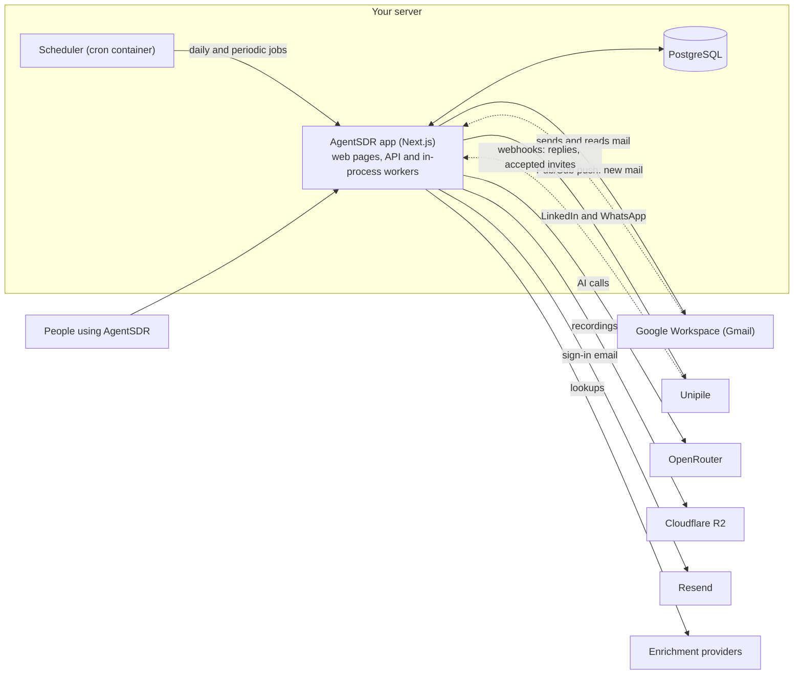
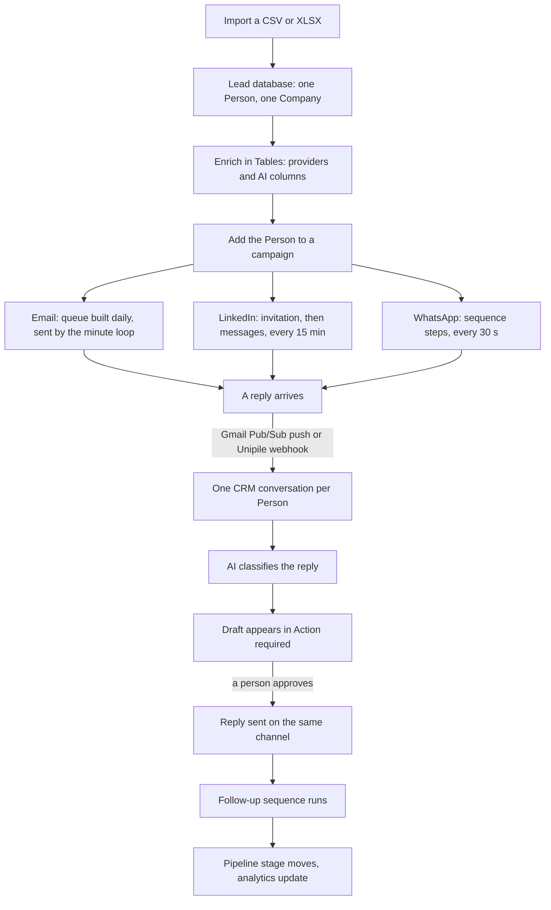
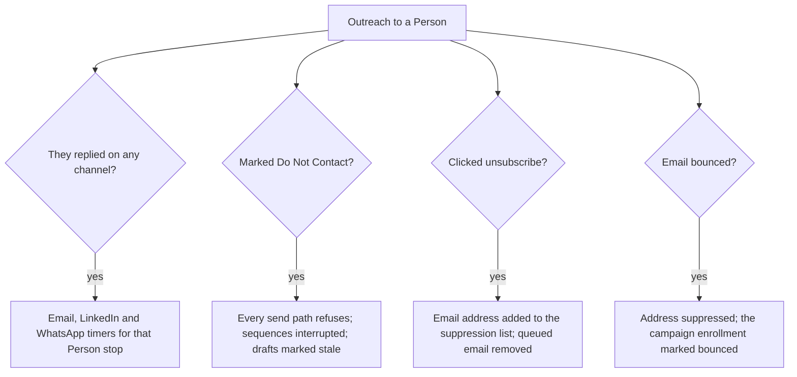
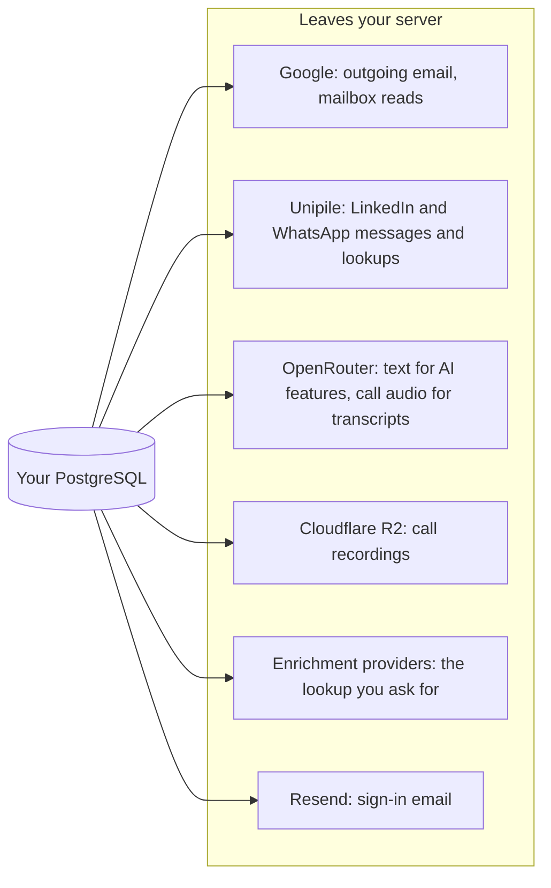

This page explains AgentSDR as an operator sees it: what is running, what talks
to what, and what happens to a lead. You do not need it to use the product, but
it helps when you host it, connect services or answer "why did that send?". For
the code-level view, read [Architecture](/architecture).

## The system

AgentSDR is **one web application and one PostgreSQL database**. There is no
queue server and no separate worker deployment. The background work runs inside
the same process as the web app, and a small scheduler calls a few web
addresses on a timer.

What runs inside the app, and how often:

| Work | How it runs | Page |
|---|---|---|
| Email sending | A loop inside the app, every minute, in production only | [Email campaigns](/email/campaigns) |
| Daily email queue | The scheduler calls the app once a day | [Email campaigns](/email/campaigns) |
| Renewing Gmail push notifications | The scheduler, daily (they expire after about 7 days) | [Gmail reply sync](/integrations/gmail-reply-sync) |
| LinkedIn invitations and follow-ups | The scheduler, every 15 minutes | [LinkedIn campaigns](/linkedin/campaigns) |
| WhatsApp campaign sends | A loop inside the app, every 30 seconds, in production only | [WhatsApp campaigns](/whatsapp/campaigns) |
| Enrichment (Tables cells) | A worker inside the app, always on | [Enrichment](/tables/enrichment) |
| Reply classification, drafts, follow-ups | A worker inside the app, always on | [CRM overview](/crm/overview) |

Because the email and WhatsApp loops have no lock between copies, run **one**
copy of the app. The schedule and its secrets are in
[Configuration](/configuration#scheduled-jobs); the tuning knobs are in
[Workers and tuning](/configuration#workers-and-tuning).

Anything that reaches AgentSDR from outside (a Gmail notification, a Unipile
webhook) needs your public address to be reachable from the internet. That is
the `BETTER_AUTH_URL` setting.

## A lead's journey

This is the path from a spreadsheet row to a booked meeting.

1. **Import.** You upload a CSV or XLSX. Email, names and company map to the
   core fields, and every other column becomes a custom field you can use as a
   merge field. See [Import leads](/leads/import) and
   [Custom fields](/leads/custom-fields). Each row becomes a **Person**, the
   one identity shared by every channel. See [Leads overview](/leads/overview).
2. **Enrich.** In Tables, columns call your enrichment providers or AI to find
   emails, companies and facts. See [Tables](/tables/overview),
   [Enrichment](/tables/enrichment) and [AI columns](/tables/ai-columns). Provider
   keys are connected in [Enrichment providers](/integrations/enrichment-providers).
3. **Campaign.** You add people to an email, LinkedIn or WhatsApp campaign.
   [Email campaigns](/email/campaigns), [LinkedIn campaigns](/linkedin/campaigns)
   and [WhatsApp campaigns](/whatsapp/campaigns) explain the sequences.
4. **Send.** Each channel paces itself by your
   [Sending rules](/workspace/sending-rules): daily limits, gaps and sending
   hours.
   - **Email.** Once a day the app builds each mailbox's queue for the day.
     The minute loop then sends what is due, from your connected
     [Google Workspace](/integrations/google-workspace) mailboxes.
   - **LinkedIn.** The scheduler runs invitations and follow-ups through
     [Unipile](/integrations/unipile), within each account's daily limit.
   - **WhatsApp.** The 30-second loop sends one step per number per tick.
5. **Reply arrives.** Gmail pushes a notification when mail comes in
   ([Gmail reply sync](/integrations/gmail-reply-sync)), and Unipile posts a
   webhook for LinkedIn and WhatsApp messages. Webhooks are verified, and
   events for accounts that do not belong to the organization are dropped.
6. **One conversation.** A reply on any channel lands in the same CRM
   conversation for that Person. See [CRM overview](/crm/overview) and the
   [Master Inbox](/email/inbox).
7. **AI classification.** A background job reads the reply and proposes a
   category, a sub-category and a pipeline stage, with a confidence. Low
   confidence changes are held for a person. See [AI provider](/workspace/ai-provider)
   for the model and key, and [Knowledge](/crm/knowledge) for the documents
   the AI may use.
8. **Draft in Action required.** The AI writes a reply draft from your
   instructions and knowledge. It waits in [Action required](/crm/action-required)
   until a person approves, edits or dismisses it. Nothing is sent by the
   draft step alone.
9. **Follow-up sequence.** A [sequence](/crm/sequences) is a series of timed
   follow-ups for a sub-category of reply. Each step becomes a new draft for
   review when it is due.
10. **Pipeline and analytics.** The person moves through the
    [pipeline](/crm/pipeline), and [Analytics](/analytics) counts what
    happened per channel.

## What stops outreach to a person

Outreach stops for four reasons. Each is enforced in code, usually in more than
one place, because the last check runs again just before the provider call.

- **A reply on any channel.** When a reply is stored in the CRM, the Person's
  pending email enrollments are set to `reply_received` and their queued emails
  are removed, their LinkedIn leads are set to `REPLIED`, and their WhatsApp
  campaign leads are set to `replied` with no next send. A reply wins over every
  cold-outreach timer. It does not mark the Person Do Not Contact.
- **Do Not Contact.** A flag on the Person, not on one channel. A person can set
  it from the CRM. It is also set automatically when a reply says something
  like "unsubscribe me" or "do not contact me", or when the AI classifies the
  reply as Do Not Contact. Setting it moves the record to Action required,
  interrupts the Person's running sequence, cancels its pending steps and marks
  open drafts stale. Email sends, LinkedIn invitations, follow-ups and
  messages, and WhatsApp sends all check it before sending, and refuse. See
  [Responsible use](/responsible-use).
- **Unsubscribe.** Every outreach email carries a signed one-click unsubscribe
  link. A click adds that address to the organization's suppression list
  (reason `unsubscribed`), removes its queued emails and stops its sequence.
  Before every send the scheduler checks the list again. This is email only: it
  does not set Do Not Contact for LinkedIn or WhatsApp. The link depends on
  `UNSUBSCRIBE_SECRET`, which you must never change after sending
  ([Configuration](/configuration#secrets)).
- **A bounce.** When Gmail delivers a bounce report, AgentSDR reads the failed
  address, adds it to the suppression list (reason `bounced`) and marks the
  enrollment bounced, so no campaign emails it again. A report that only says
  delivery is delayed does not suppress yet, and a report that cannot be read
  is kept for a person to look at.

A few more guards apply to WhatsApp: no new chats for 24 hours after a number is
linked, and a daily cap on new chats per number. See
[WhatsApp accounts](/whatsapp/accounts).

## Where your data lives, and what leaves your server

Everything AgentSDR stores is in **your PostgreSQL**: people, companies,
campaigns, messages, the CRM and the settings. Saved integration credentials
are in the same database, encrypted with `INTEGRATION_CREDENTIALS_KEY`.
Recordings are the one thing stored elsewhere, in your own Cloudflare R2 bucket.

AgentSDR sends data out only to services you connect, only when a feature needs
them, and never from environment variables you did not set.

| Service | When data leaves | What goes |
|---|---|---|
| [Google Workspace](/integrations/google-workspace) | A campaign or manual email sends; replies and bounces are read | The email you send, and the mailbox content that Gmail returns. |
| [Unipile](/integrations/unipile) | LinkedIn and WhatsApp sends, account sync, searches | Message text and the profile or number being contacted. |
| [OpenRouter](/integrations/openrouter) | Reply classification, drafting, AI columns, call transcription | The reply and its conversation, the lead's details, your knowledge and instructions; for transcription, the call audio. It is your own key, so the usage is billed to you. |
| [Cloudflare R2](/integrations/cloudflare-r2) | A [WhatsApp call](/whatsapp/calling) is recorded | The recording, to your bucket. It is read back only through short-lived signed links. |
| [Enrichment providers](/integrations/enrichment-providers) | A Tables enrichment column runs | The fields that column sends, such as a name, company or domain. |
| [Resend](/integrations/resend) | Sign-up verification, password reset, invitations | The recipient's address and the link. |
| A URL you name in a Tables HTTP column | That column runs | Whatever you put in the request. Its token can come from a server environment variable ([details](/configuration#user-named-variables-tables-http-column)). |

If a service is not connected, the feature that needs it is off and
nothing is sent: see [Integrations](/integrations).

## Organizations and isolation

Every piece of business data belongs to exactly one **organization**, and people
work inside one. Roles are owner, admin and member: members use the product,
while owners and admins also manage integrations, AI settings, members and
teams. Integrations, AI settings, sending rules, pipelines and sequences are per
organization, so two organizations on one server share nothing and cannot see,
change or count each other's data. Background jobs and webhooks work out which
organization an item belongs to from the data itself (the mailbox, the Unipile
account) before they touch it. See [Organizations](/workspace/organizations);
the rulebook is in [Multi-tenancy conventions](/multi-tenancy/conventions).

## Next

<CardGroup cols={2}>
  <Card title="Quickstart" icon="rocket" href="/quickstart">
    Connect a mailbox and send a first campaign.
  </Card>
  <Card title="Concepts" icon="book-open" href="/concepts">
    The words the product uses, in one place.
  </Card>
  <Card title="Self-hosting" icon="server" href="/self-hosting">
    Run AgentSDR on your own server.
  </Card>
  <Card title="Architecture" icon="blocks" href="/architecture">
    The developer view of the same system.
  </Card>
</CardGroup>
