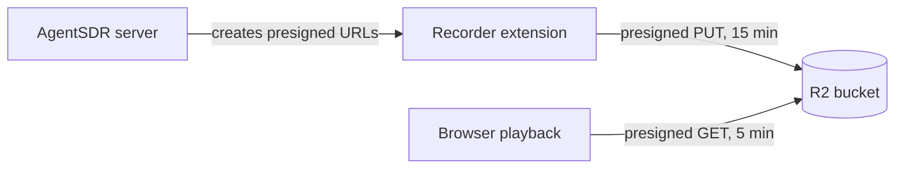

Cloudflare R2 is the file storage AgentSDR uses for WhatsApp call recordings and contact photos. You need it before you place recorded calls. Without it those two features are off.

<Info>
**What you need**

- A Cloudflare account with an R2 subscription. Cloudflare bills R2 usage to you directly, with a free allowance each month. Check [R2 pricing](https://developers.cloudflare.com/r2/pricing/) for current terms.
- The **owner** or **admin** role in AgentSDR.
- About 10 minutes.
</Info>

## Overview

AgentSDR stores two kinds of files in your bucket:

- **Call recordings**, under `calls/YYYY/MM/` (one file per call, Opus audio in a `.webm` or `.ogg` container).
- **Contact photos**, under `photos/people/`.

Nothing in the bucket is public. The recorder extension uploads each recording with a **presigned URL** that AgentSDR creates for that one file, and it expires after 15 minutes. Playback in the app uses a presigned link that expires after 5 minutes. Contact photos are shown through a link valid for 1 hour. The Cloudflare key you save never leaves the server.

## Connect Cloudflare R2

<Steps>
  <Step title="Create a bucket">
    In the [Cloudflare dashboard](https://dash.cloudflare.com), open **Storage & databases → R2 object storage** and create a bucket (see [Cloudflare's guide](https://developers.cloudflare.com/r2/buckets/create-buckets/)). A bucket name uses only lowercase letters, numbers and hyphens, 3 to 63 characters, and does not start or end with a hyphen. Leave it private (the default). If R2 is not enabled yet, Cloudflare asks you to add an R2 subscription first.
    {/* SCREENSHOT: R2 create bucket form | dash.cloudflare.com, Storage & databases, R2 object storage | the bucket name field */}
  </Step>
  <Step title="Copy your Account ID">
    AgentSDR builds the storage address `https://ACCOUNT_ID.r2.cloudflarestorage.com` from it. In the dashboard, press `Cmd/Ctrl + K`, type **Copy account ID** and select the result. Other places are listed in [Cloudflare's guide](https://developers.cloudflare.com/fundamentals/account/find-account-and-zone-ids/).
  </Step>
  <Step title="Create an R2 API token">
    On the R2 object storage page, click **Manage** next to **API Tokens** (under Account Details). Click **Create Account API token** (or **Create User API token**). Under Permissions choose **Object Read & Write**, and scope the token to the bucket you created. Create it. Cloudflare shows an **Access Key ID** and a **Secret Access Key**. Copy both now: the secret is shown only once. Details are in [Cloudflare's token guide](https://developers.cloudflare.com/r2/api/tokens/).
    {/* SCREENSHOT: Create API token form with Object Read & Write and a bucket selected | dash.cloudflare.com, R2 API tokens | the permission and the bucket scope */}
    {/* SCREENSHOT: Token created page | dash.cloudflare.com | Access Key ID and Secret Access Key */}
  </Step>
  <Step title="Open the Integrations page in AgentSDR">
    Go to **Settings → WhatsApp → Integrations**. On the **Cloudflare R2** card, click **Connect**.

    <Frame caption="Four fields, then Connect and test.">
      
    </Frame>
  </Step>
  <Step title="Fill in the four fields">
    | Field | Where the value is |
    |---|---|
    | **Account ID** | Step 2. |
    | **Bucket name** | The bucket's name exactly as listed under R2 object storage. |
    | **Access key ID** | Shown when you created the token in step 3. |
    | **Secret access key** | Shown once, next to the access key ID. |
  </Step>
  <Step title="Click Connect & test">
    AgentSDR sends one `HeadBucket` request to your bucket with these credentials. If it succeeds, the card shows **Connected**.
  </Step>
</Steps>

<Note>
You do not need to set up CORS on the bucket. Recordings are uploaded by the recorder extension's background service worker, which has its own host permissions, so the browser does not apply CORS to those requests.
</Note>

## Check that it works

<Check>
The **Cloudflare R2** card shows **Connected** and a **Last verified** time.
</Check>

To test end to end, place a short recorded WhatsApp call as described in [Calling](/whatsapp/calling). After the call ends, an object appears in your bucket under `calls/`, and the recording plays on the call.

## Troubleshooting

<AccordionGroup>
  <Accordion title='Bucket "name" does not exist'>
    R2 answered 404. Check the **Bucket name** against the list in the Cloudflare dashboard, including hyphens and case.
  </Accordion>
  <Accordion title="R2 rejected these credentials for that bucket">
    R2 answered 401 or 403. The Access Key ID or Secret Access Key is wrong, or the token is not scoped to this bucket, or it lacks **Object Read & Write**. Create a new token and paste both values again.
  </Accordion>
  <Accordion title="Could not reach R2 with this account ID">
    Any other failure. Check the **Account ID** for typos and that your server can reach the internet. If the bucket was created with a jurisdiction (EU, FedRAMP), its endpoint differs from the standard one AgentSDR uses, so use a bucket without a jurisdiction.
  </Accordion>
  <Accordion title="Cloudflare R2 is not connected — connect it in Settings → WhatsApp → Integrations">
    A feature needing R2 (recording, playback, photos) answered 409 because this organization has not connected it. Connect it as above.
  </Accordion>
  <Accordion title="storage answered 403">
    The recorder extension reports `storage answered` followed by R2's status when its upload fails. A 403 usually means the token cannot write to this bucket. Check the token has **Object Read & Write** on it, re-save the credentials, then place a new call.
  </Accordion>
</AccordionGroup>

## Next

<CardGroup cols={2}>
  <Card title="WhatsApp calling" icon="phone" href="/whatsapp/calling">
    Place and record calls.
  </Card>
  <Card title="OpenRouter" icon="sparkles" href="/integrations/openrouter">
    Turn on call transcription.
  </Card>
  <Card title="Unipile" icon="link" href="/integrations/unipile">
    The connection that links your WhatsApp numbers.
  </Card>
  <Card title="Integrations overview" icon="plug" href="/integrations">
    All integrations and who can connect them.
  </Card>
</CardGroup>
