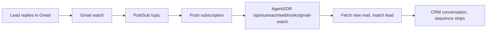

Sending email works as soon as [Google Workspace](/integrations/google-workspace) is connected. Replies do not arrive until you also set up Pub/Sub. AgentSDR only learns about new mail when Gmail pushes a notification to it, so without this page, replies are not picked up and a sequence keeps going after someone answers.

<Info>
**What you need**

- [Google Workspace](/integrations/google-workspace) already connected, with the same Google Cloud project.
- Permission to create Pub/Sub topics and edit their access in that project.
- A public **HTTPS** address for your AgentSDR (your `BETTER_AUTH_URL`) with a valid certificate. A `localhost` install cannot receive pushes.
- Ability to schedule one daily call to AgentSDR ([Production setup](/self-hosting/production)).
- About 15 minutes.
</Info>

## Overview

Gmail does not call you when mail arrives, unless you ask it to. AgentSDR asks Gmail to "watch" each connected mailbox's inbox and publish to a Pub/Sub topic. A push subscription forwards each notification to AgentSDR, which fetches the new messages, matches them to the lead and moves the conversation along in the CRM.



A Gmail watch expires after about seven days. Google's documentation says to call `watch` at least every 7 days and recommends once a day. AgentSDR does this when you call its renewal endpoint, so you schedule that endpoint daily (step 5).

<Steps>
  <Step title="Create a topic">
    In the [Google Cloud console](https://console.cloud.google.com) pick the same project you used for Workspace, open **Pub/Sub → Topics** and click **Create topic**. Enter a Topic ID such as `agentsdr-gmail`. You can untick **Add a default subscription**, because you create a push subscription in step 4. Click **Create topic**.

    The topic's full name is `projects/<project-id>/topics/<topic-id>`, for example `projects/my-project/topics/agentsdr-gmail`. You can copy it from the topic page.

    <Frame caption="The full topic name under the field is what AgentSDR asks for.">
      
    </Frame>
  </Step>
  <Step title="Let Gmail publish to the topic">
    Open the topic, show the **Permissions** panel (the info panel on the right, or the **Permissions** tab), click **Add principal** and enter:

    ```text
    gmail-api-push@system.gserviceaccount.com
    ```

    Choose the role **Pub/Sub Publisher** and save. This is a Google-owned account; it is how Gmail is allowed to write notifications to your topic. Without it, registering a watch fails.

    <Frame caption="When the grant is in place, the topic Permissions panel lists the Gmail push account under Pub/Sub Publisher.">
      
    </Frame>
  </Step>
  <Step title="Save the topic name in AgentSDR">
    Open **Settings → Email → Connection**, click **Edit** on the **Google Workspace** card and paste the full name into **Gmail Pub/Sub topic**, for example `projects/my-project/topics/agentsdr-gmail`. Leave **Private key** blank to keep the saved key. Click **Save**. AgentSDR refuses a value that does not match `projects/<project>/topics/<topic>`.
  </Step>
  <Step title="Create a push subscription">
    Open **Pub/Sub → Subscriptions** and click **Create subscription**. Enter a Subscription ID (for example `agentsdr-gmail-push`), select your topic, and set **Delivery type** to **Push**. In **Endpoint URL** enter:

    ```text
    https://<your-domain>/api/outreach/webhooks/gmail-watch
    ```

    Replace `<your-domain>` with your public address (the same host as `BETTER_AUTH_URL`). Google requires a publicly reachable HTTPS endpoint with a certificate from a certificate authority. Leave the other options at their defaults and click **Create**.

    There is no secret to add. Pub/Sub push cannot carry one, so the endpoint only acts on addresses that are connected mailboxes in AgentSDR and acknowledges everything else. See [Pub/Sub push docs](https://docs.cloud.google.com/pubsub/docs/create-push-subscription).

    <Frame caption="Choose Push and paste your AgentSDR gmail-watch endpoint.">
      
    </Frame>
  </Step>
  <Step title="Schedule the daily watch renewal and run it once">
    AgentSDR registers the watches when this endpoint is called, not when you add a mailbox. Call it once now, then every day:

    ```bash
    curl -fsS -X POST -H "x-tick-secret: $OUTREACH_TICK_SECRET" "https://<your-domain>/api/outreach/mailboxes/watch"
    ```

    The secret is your `OUTREACH_TICK_SECRET` (sent as the `x-tick-secret` header or `?secret=`). Without it the endpoint answers 401. The reply lists each mailbox with `ok: true`, or an `error`. Organizations that have no topic saved are listed under `skipped` with `gmail_watch_topic_not_configured`. How to schedule it with cron or your host's scheduler is in [Production setup](/self-hosting/production).
  </Step>
</Steps>

## Check that it works

1. Run the renewal call from step 5 and confirm your mailbox shows `"ok": true`.
2. From a different address, reply to an email sent from that mailbox (or just send it a new message).
3. Within a short time the message appears in the CRM under [Action required](/crm/action-required) or the [Email inbox](/email/inbox).

In Google Cloud, **Pub/Sub → Subscriptions → your subscription → Metrics** shows messages being delivered, and no growing backlog of unacknowledged ones.

<Note>
A local install (`localhost`) cannot receive pushes, because Google's servers cannot reach it. Test this on your deployed instance.
</Note>

## Troubleshooting

<AccordionGroup>
  <Accordion title="Gmail pub/sub topic must look like projects/<project>/topics/<topic>">
    The field holds something else, such as just the topic name. Use the full name from the topic page.
  </Accordion>
  <Accordion title="Watch result shows an error mentioning the topic or User not authorized">
    Gmail could not publish to your topic. Check step 2: the principal `gmail-api-push@system.gserviceaccount.com` must have **Pub/Sub Publisher** on that exact topic, and the topic must be in the project named in the field.
  </Accordion>
  <Accordion title="skipped: gmail_watch_topic_not_configured">
    No topic is saved on the Google Workspace card. Do step 3.
  </Accordion>
  <Accordion title="skipped: google_not_connected">
    Google Workspace is not connected for that organization. See [Google Workspace](/integrations/google-workspace).
  </Accordion>
  <Accordion title="401 unauthorized from the watch endpoint">
    `OUTREACH_TICK_SECRET` is unset, or the value you sent differs. It is set in your environment, see [Configuration](/configuration).
  </Accordion>
  <Accordion title="Replies worked, then stopped after about a week">
    The watch expired because the daily job is not running. Schedule step 5 and run it once by hand.
  </Accordion>
  <Accordion title="Pub/Sub shows delivery errors or a growing backlog">
    The endpoint is not reachable over HTTPS, the certificate is invalid, or a firewall blocks Google. Open the URL path from outside your network; a `POST` should answer 200. Note that AgentSDR answers 200 even for pushes it ignores, so only unreachable endpoints cause retries.
  </Accordion>
</AccordionGroup>

## Next

<CardGroup cols={2}>
  <Card title="Production setup" icon="clock" href="/self-hosting/production">
    Schedule the daily jobs.
  </Card>
  <Card title="Email inbox" icon="inbox" href="/email/inbox">
    Where replies show up.
  </Card>
  <Card title="Action required" icon="bell" href="/crm/action-required">
    Work through replies that need an answer.
  </Card>
  <Card title="Google Workspace" icon="mail" href="/integrations/google-workspace">
    The service account this builds on.
  </Card>
</CardGroup>
