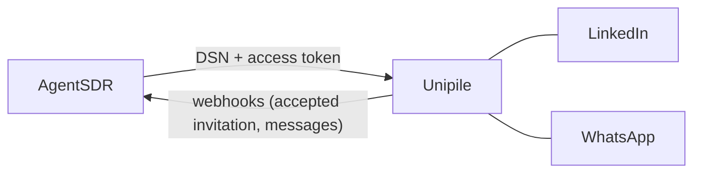

Unipile is the service AgentSDR uses to reach LinkedIn and WhatsApp. You connect it once per organization. Without it, LinkedIn accounts and campaigns and WhatsApp messaging and calling are off.

<Info>
**What you need**

- A Unipile account (dashboard.unipile.com). Unipile is a paid service billed by Unipile directly. AgentSDR does not charge for it and this page lists no prices: check Unipile's own pricing.
- The **owner** or **admin** role in AgentSDR.
- Your AgentSDR running at a public address (`BETTER_AUTH_URL`) if you want webhooks registered automatically.
- About 10 minutes.
</Info>

## Overview

Unipile powers:

- **LinkedIn**: connection invitations, messages, search and inbox sync. See [LinkedIn accounts](/linkedin/accounts).
- **WhatsApp**: messaging, the Numbers list and calling. See [WhatsApp numbers](/whatsapp/accounts).
- **Webhooks**: Unipile tells AgentSDR when an invitation is accepted or a message arrives.

LinkedIn and WhatsApp use the **same** Unipile connection. You can open it from **Settings → LinkedIn → Connection** or from **Settings → WhatsApp → Integrations**. Each page notes that changing it in one place changes it in the other.

## Connect Unipile

<Steps>
  <Step title="Create or sign in to your Unipile account">
    Sign up at [dashboard.unipile.com/signup](https://dashboard.unipile.com/signup) or sign in at [dashboard.unipile.com/login](https://dashboard.unipile.com/login).
    {/* SCREENSHOT: Unipile dashboard home showing the DSN | dashboard.unipile.com | the DSN shown at the top */}
  </Step>
  <Step title="Copy your DSN">
    The dashboard shows your **DSN**, the address of your Unipile API, for example `api8.unipile.com:13851`. Copy it as it appears. You can leave off `https://`: AgentSDR adds it.
  </Step>
  <Step title="Generate an access token">
    Open [Access tokens](https://dashboard.unipile.com/access-tokens) in the dashboard and generate a token. Copy it now: Unipile shows it only once.
    {/* SCREENSHOT: Access tokens page after generating a token | dashboard.unipile.com/access-tokens | the Generate button and the token value */}
  </Step>
  <Step title="Open the Connection page in AgentSDR">
    Go to **Settings → LinkedIn → Connection** (or **Settings → WhatsApp → Integrations**). The **Unipile** card shows **Not connected**. Click **Connect**. Open **How to connect** in the dialog for the same steps in short form.

    <Frame caption="Three fields, then Connect and test.">
      
    </Frame>
  </Step>
  <Step title="Fill in the fields">
    | Field | What to enter |
    |---|---|
    | **DSN (API address)** | The DSN from step 2. |
    | **Access token** | The token from step 3. |
    | **Webhook secret** | Leave it empty. AgentSDR generates one on the first save. Fill it in only to keep a secret you already use. |
  </Step>
  <Step title="Click Connect & test">
    The button shows **Testing…** while AgentSDR calls Unipile once to check the DSN and token. If the check passes, the integration is saved (when editing later, the button reads **Save**) and the card shows **Connected** with a **Last verified** time.
  </Step>
</Steps>

### What saving does

1. **Live verification.** AgentSDR asks Unipile for one account (`GET /api/v1/accounts?limit=1`) with your token. A wrong DSN or token fails here and nothing is saved.
2. **Webhook registration.** AgentSDR registers the webhooks it needs in your Unipile workspace through Unipile's API, so you do not set anything up in the Unipile dashboard. Registration replaces earlier ones and never duplicates. It is **skipped on a localhost address**, because Unipile's servers cannot reach it. Run AgentSDR at its public address and click **Register again**, or save again, to register.

The card's **Webhooks** line shows a badge: **2 registered** (green), **Registration failed**, **Not registered** (skipped, for example on a local address) or **Not registered yet**, with **Register again** and **Show URLs and secret** (owners and admins). The URLs, the secret and how deliveries are checked are in the [Webhooks reference](/integrations#webhooks-reference).

## Link accounts

Connecting Unipile gives AgentSDR access to your Unipile workspace. You then link the actual LinkedIn profiles and WhatsApp numbers.

<Tabs>
  <Tab title="LinkedIn">
    1. Go to **Settings → LinkedIn → Accounts** and click **Connect LinkedIn account**.
    2. You are sent to Unipile's hosted sign-in. Sign in to LinkedIn there and finish any verification. AgentSDR never sees your LinkedIn password. The link is single-use and short-lived (15 minutes), so use it right away.
    3. You return to the Accounts page, which syncs the account from Unipile.

    See [LinkedIn accounts](/linkedin/accounts) for statuses, limits and **Reconnect**.
  </Tab>
  <Tab title="WhatsApp">
    1. In the Unipile dashboard, open **Accounts**, choose **Connect**, pick **WhatsApp**, and scan the QR code with the phone that owns the number.
    2. In AgentSDR go to **Settings → WhatsApp → Numbers** and click **Sync from Unipile**.

    LinkedIn and WhatsApp accounts are read separately: the WhatsApp sync never touches LinkedIn accounts. See [WhatsApp numbers](/whatsapp/accounts) for warm-up and sending limits.
  </Tab>
</Tabs>

## Check that it works

<Check>
The Unipile card shows **Connected** and a **Last verified** time, and its **Webhooks** line shows **2 registered**.
</Check>

1. In the Unipile dashboard, open the webhooks list. You should see two entries named **AgentSDR · LinkedIn connection accepted** and **AgentSDR · Messages (LinkedIn and WhatsApp)**, pointing at your public address with `?org=` in the URL.
2. Link an account (above) and confirm it appears under **Settings → LinkedIn → Accounts** or **Settings → WhatsApp → Numbers**.
3. Send yourself a WhatsApp message to a linked number. A message arriving is stored first in a webhook ledger, so even a failed delivery is retried by the `replay-webhooks` job ([Self-hosting](/self-hosting)).

## Troubleshooting

<AccordionGroup>
  <Accordion title="Could not reach Unipile at that API URL">
    AgentSDR could not connect to the DSN within 15 seconds. Check for typos and copy the DSN exactly from the top of the Unipile dashboard. Make sure the server running AgentSDR can reach the internet.
  </Accordion>
  <Accordion title="Unipile DSN must look like api8.unipile.com:13851">
    The DSN has a path, spaces or a non-HTTPS scheme. Paste only the host and port.
  </Accordion>
  <Accordion title="Unipile rejected the access token">
    Unipile answered 401 or 403. Generate a new token under Access tokens and paste it again. Tokens are shown only once.
  </Accordion>
  <Accordion title="Unipile answered 500 (or another status)">
    The message is `Unipile answered` followed by the HTTP status. Try again later and check Unipile's status. Any status other than 401 and 403 comes from Unipile, not from your credentials.
  </Accordion>
  <Accordion title="Registration failed, or Not registered">
    Click **Register again**. A message that starts with `Unipile answered` shows what Unipile refused. If the Webhooks line says the address is local, `BETTER_AUTH_URL` is a localhost address: set it to your public URL and register again. If it says no public address, `BETTER_AUTH_URL` is not set. Or use **Show URLs and secret** and create the webhooks by hand in Unipile with the header `x-unipile-secret`.
  </Accordion>
  <Accordion title="Unipile is not connected — connect it in Settings → LinkedIn → Connection">
    A feature needing Unipile answered HTTP 409 because this organization has not connected it. Connect it as above. The same message appears as a **Connect Unipile** prompt on the accounts pages.
  </Accordion>
  <Accordion title="Messages or accepted invitations do not arrive">
    Confirm the Webhooks line says **2 registered**, that your AgentSDR is reachable from the internet, and that the account belongs to this organization. Events for an account that is not synced yet, or that belongs to another organization, are acknowledged and dropped. Sync the account first.
  </Accordion>
  <Accordion title="Connected, but the sync failed">
    The hosted sign-in worked but the follow-up sync did not. The account appears after the next outreach run, or sync again.
  </Accordion>
</AccordionGroup>

## Next

<CardGroup cols={2}>
  <Card title="LinkedIn accounts" icon="linkedin" href="/linkedin/accounts">
    Statuses, limits and reconnecting.
  </Card>
  <Card title="WhatsApp numbers" icon="message-circle" href="/whatsapp/accounts">
    Link numbers and understand the guards.
  </Card>
  <Card title="Cloudflare R2" icon="cloud" href="/integrations/cloudflare-r2">
    Needed to store call recordings.
  </Card>
  <Card title="Integrations overview" icon="plug" href="/integrations">
    Webhooks reference and who can connect what.
  </Card>
</CardGroup>
